  <html><body><b>How to open a scenery project and show it in MSFS</b>  
  
  Always, first start a flight in MSFS. Projects can only be opened when you start a flight, because that initializes BING. 
  The example project is located at EHMD Malden Airfield in the Netherlands.   
  
  So it is best to start loading <b>EHMD Malden Airfield</b>. Then go General Options an set Developer mode.   
  
  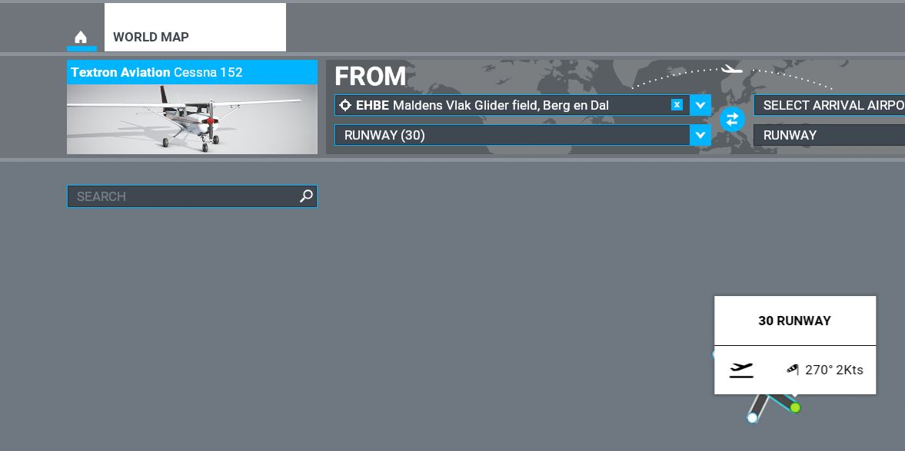 
  
  <a href="../MySimpleScenery/MySimpleScenery.zip">Click here to download the checkers cube scenery in MSFS project format</a>  

  I placed the project files in MSFS SDK\Samples, but you could unpack the zipfile anywhere else on your disk.  
  Below overview shows the directories and files in the Example project 
  
  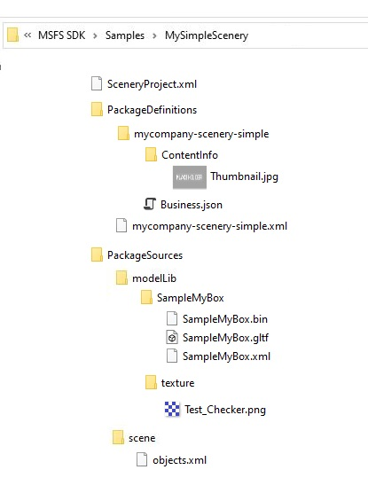  
  
  Now, open the project in MSFS, 
  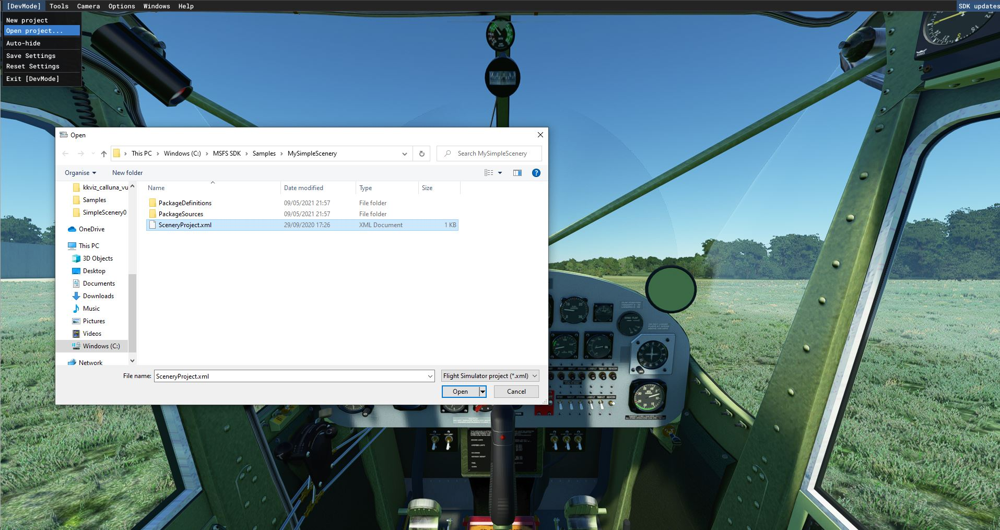
    
  Make sure you open the console, 
  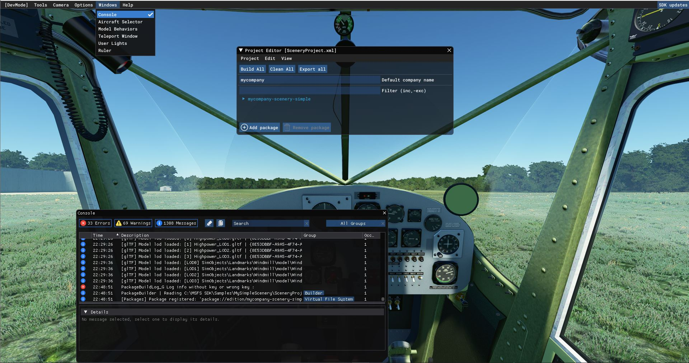
    
  .. and CLEAR the console, 
  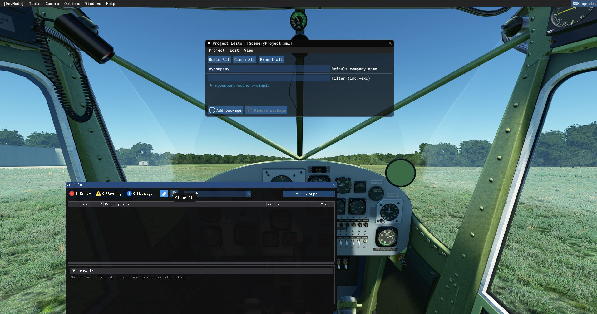
    
  Then click <b>Project - Build</b>   
   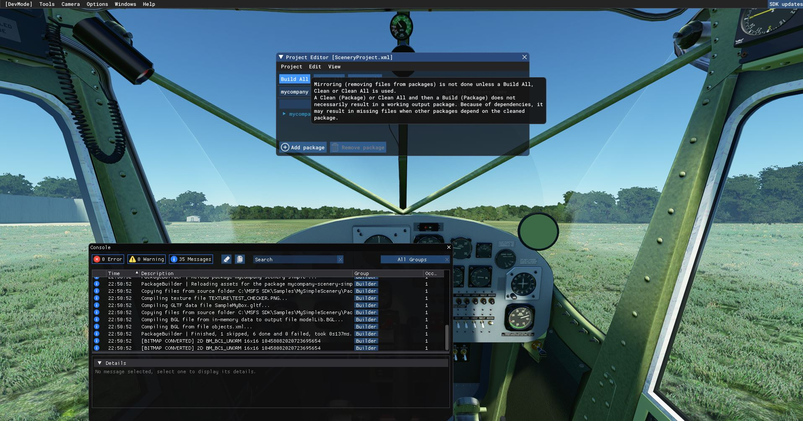
    
  .. and check the console. If it shows errors, clear it again and Project - Build, the console should have 0 errors. 
    
  Then, open the Scenery editor via Menu Tools Scenery Editor, 
   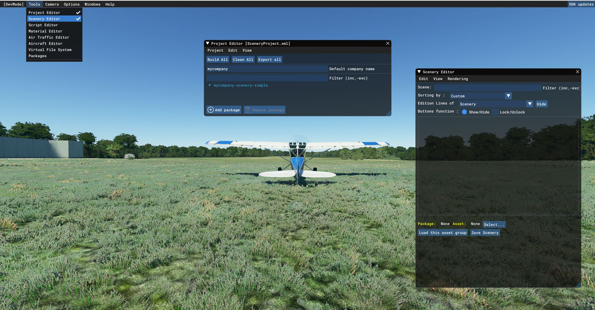
    
  When it is enabled, click <b>Load this assset group</b>, else use Select to select the Asset. 
  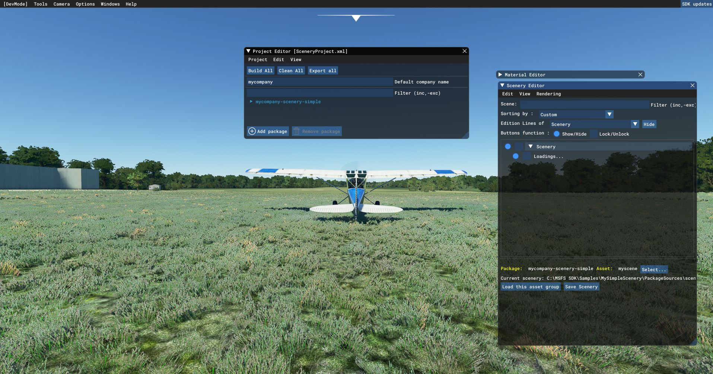</img>
    
  .. the scenery is now loading.. <b>WAIT</b> for this.. when it is finished, you will see the checkers cube 
  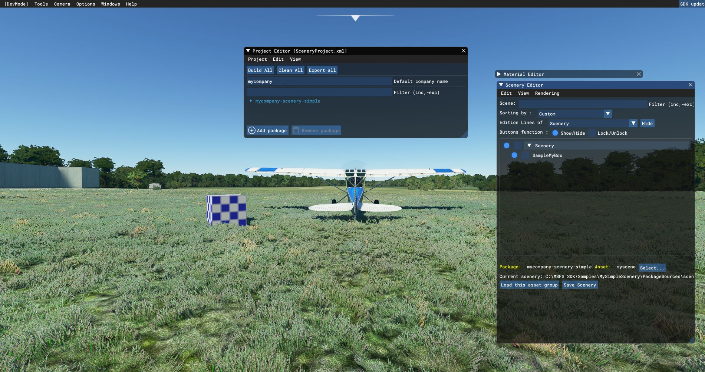</img>  
    
  Now, in the Scenery Editor, select menu <b>View - Objects</b> 
  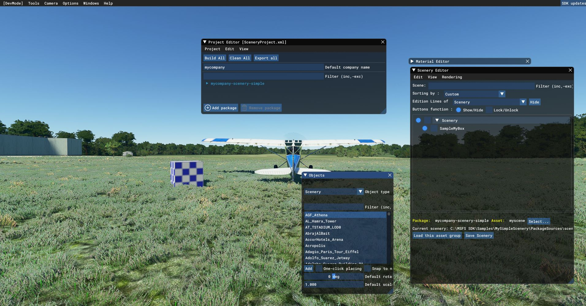</img>
    
Find your object, by typing the name in the search box. Select it. Then check <b>"One-click placing"</b> 
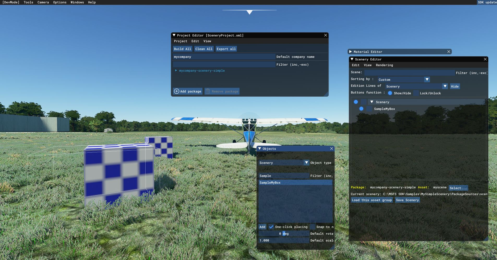</img>
    
  To place an object, <b>left mouse button</b>. Uncheck One-click placing for now. We'll not repeat placement. 
   
   Left-click on your object. Using keys W and R you can move and rotate the object.. 
  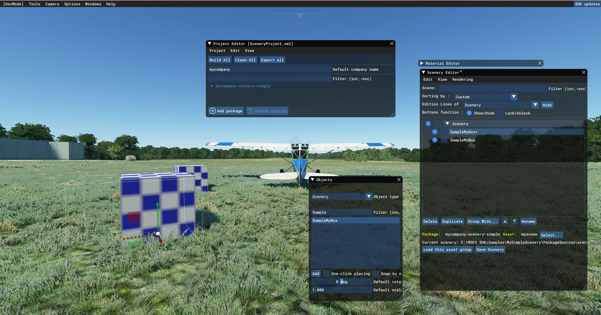</img>
    
  In order to place save your scenery, that is place your object permanently, issue <b>Save Scenery</b> 
  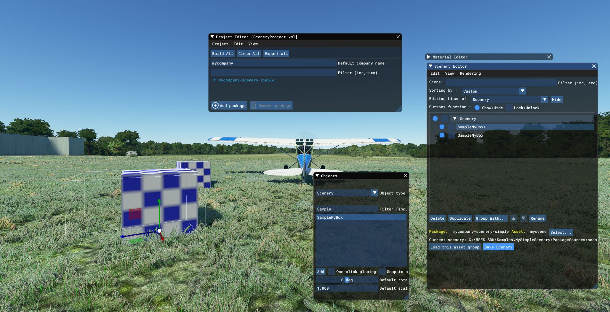</img>
  .. and now repeat: <b>Project - Build</b>  
  After doing this, you could leave SDK mode and fly around. Your scenery will remain where it is.. 
  
    
  <b>How to modify the example project</b>  
  Below slides will explain how to add your own Blender design into MSFS

  Load the landart example you have downloaded in Tutorial #2 (the example Blender Land Art object <b>FancyShape2L.blend</b>)
  
  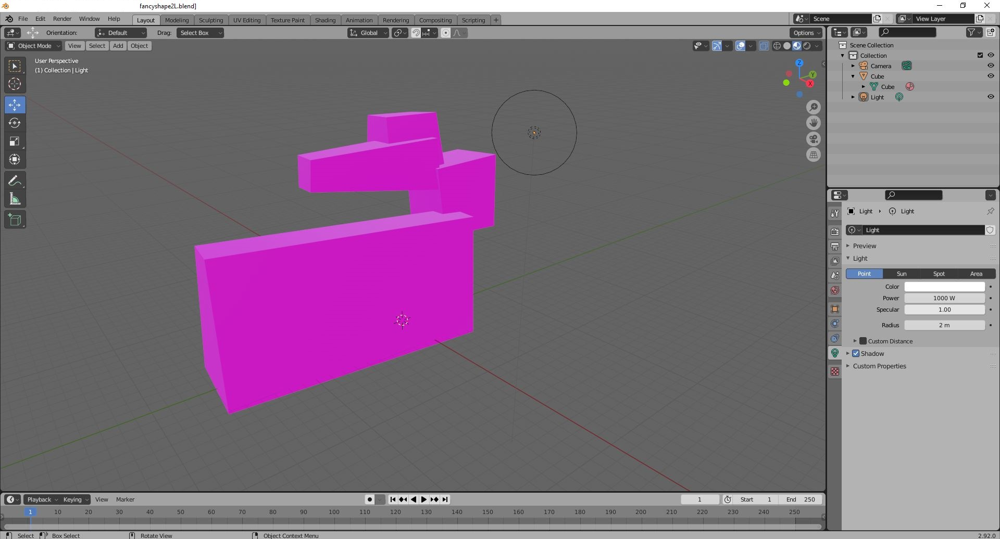
  
  In Blender, you can now modify this object at will. For now, we'll export it to MSFS right away.
  To do that, select both the violet Object and the Light
  
  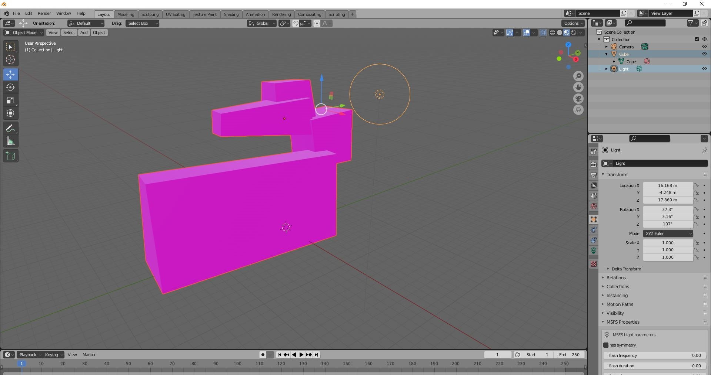
  
  Go File menu, select Export. You'll get options to export glBT to MSFS. If you don't get this export option, check Tutorial #2 and download the addin for Blender.
  
   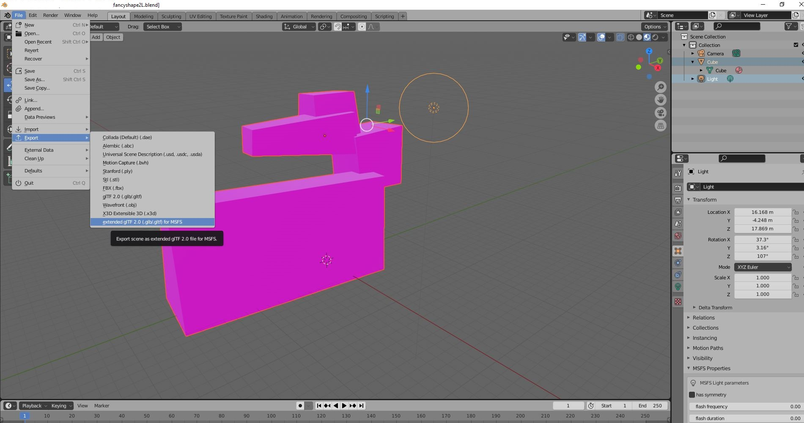
   
  On the right, some options are shown. Make sure you
    - click the XML option
    - fillin the name of your object as XML name (in this case: FancyShape2L)
    - Check the option to export selected objects

   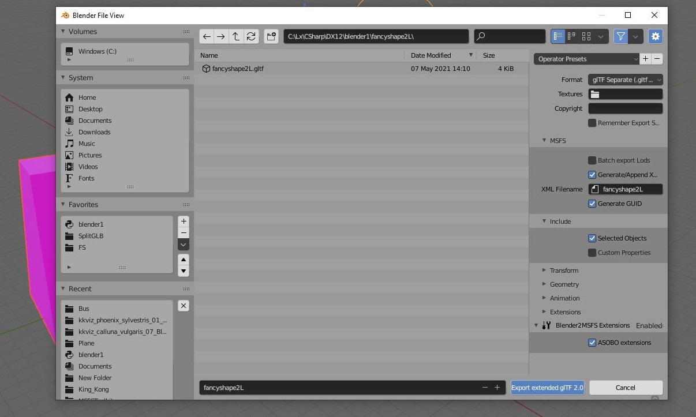

  Now click <b>Export to GLB 2.0 for MSFS</b>. Put the three result files into a new subdirectory PackageSources\Modellib\FancyShape2L in the MSFS project.
  
  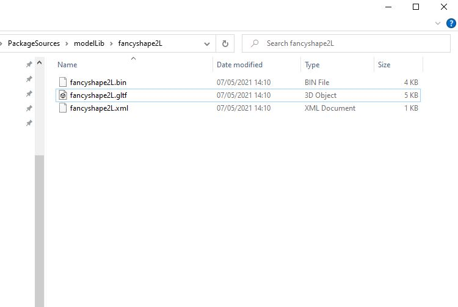
  
  When you now go back to MSFS, close and Open the project and follow above procedure again, you will find FancyShape2L
  in the objects box and you'll be able to place it !
  
   
  <b>How to export to Community</b>  
    
  When you want to re-use your scenery every time MSFS is loaded, you can use the Project Editor <b>Export</b> option, which 
  will create a ready made ZIP-file for Community in \Packages folder in your project.  

  </body></html>

